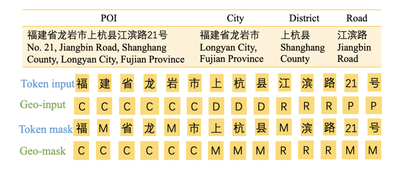
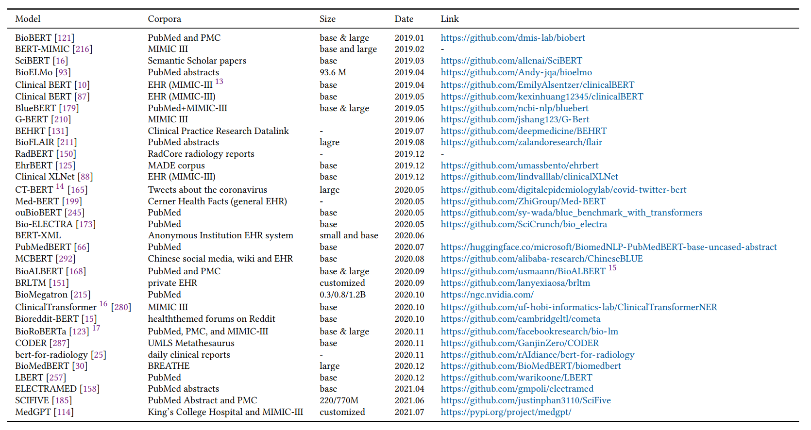

# Domain Pre-Train Language models
---

## Awesome Domain Pre-Train Language models

|id|year|venue|name|paper|url|domain|type|vocab|text corpus origin|text corpus size|input length|batchsize|epoch|hardware arch|Task|Group|
|:---:|:---:|:---:|:---:|:---:|:---:|:---:|:---:|:---:|:---:|:---:|:---:|:---:|:---:|:---:|:---:|:---:|
|1|2019|ACL|SciBERT|SCIBERT: A Pretrained Language Model for Scientific Text|[1](https://github.com/allenai/scibert)|scientific|continual|**SciVocab**|1.14M, 18% CS + 82% bimedical|3.17B tokens|128, 512|-|-|a single TPU v3 with 8 cores **1 week**|NER, PICO Extraction, Text Classification, Relation Classification, Dependency Parsing|AllenAI|
|2|2019|BioInformatics|BioBERT|BioBERT: a pre-trained biomedical language representation model for biomedical text mining|[1](https://github.com/naver/biobert-pretrained), and [2](https://github.com/dmis-lab/biobert)|continual|biomedicine|original BERT vocabulary|BERT Corpus and PubMed abstracts and PMC full text articles|20B tokens|-|-|-|23 days on eight NVIDIA V100 GPUs|NER, RE, QA|Clova AI Research|
|3|2019|-|ClincalBERT|ClinicalBERT: Modeling Clinical Notes and Predicting Hospital Readmission|[1](https://github.com/kexinhuang12345/clinicalBERT)|continual|biomedicine|original BERT vocabulary|2M clinical text from the MIMIC-III databaset|the same as bert|128, 512|64, 8|100,000 + 100,000|2 Intel Xeon E5-2670v2 2.5GHZ CPUs, 128GB RAM and 2 NVIDIA Tesla P40 GPUs|diagnosis prediction, mortality risk estimation, or length-of-stay assessment|Harvard|
|4|2021|ACM Transactions on Computing for Healthcare|PubMedBERT|Domain-Specific Language Model Pretraining for Biomedical Natural Language Processing|[Resources:BLURB](https://aka.ms/BLURB)|From scratch|biomedicine|newly build|PubMed abstract|14 million abstracts, 3.2 billion words/21 GB|128|8,192|warm-up in 10% of steps and cool-down in 90% of steps|5 days on one DGX-2 machine with 16 V100 GPUs|NER, PICO, RE, Similarity, Classification, QA|Microsoft Research|
|5|2020|EMNLP-Findings|LEGAL-BERT|LEGAL-BERT: The Muppets straight out of Law School|[1](https://huggingface.co/nlpaueb)|legal|continual, from scratch|Bert and newly create|12 GB of diverse English legal text from several fields  scraped from publicly available resources|12G|128, 512|26|40, (further pretrain 3,4 epochs|**exp. on 11GB NVIDIA-2080TI**, train on v3 TPUs with 8 cores from Google Cloud Compute Services|NER, Classification|University of Sheffield|
|**6**|2020|EMNLP-Demos|BERTweet|BERTweet: A pre-trained language model for English Tweets|[1](https://github.com/VinAIResearch/BERTweet)|social media|From scrath|TweetTokenizer from nltk|80GB pre-training dataset of uncompressed texts, containing 850M Tweets|16B word tokens|128|7K|40, 2 for warm up|8 V100 GPUs (32GB each)|POS tagging, NER and text classification|NVIDIA|
|7|2020|ArXiv|FinBERT|FinBERT: A Pretrained Language Model for Financial Communications|[1](https://github.com/yya518/FinBERT)|Finance|further pretrained|FinVocab|corporate reports, earnings conference call transcripts and analyst reports|4.9B tokens|128, 512|128|250K iterations|NVIDIA DGX-1 machine. 4 Tesla P100 GPUs, a total of 128 GB of GPU memory|sentiment classification|Hong Kong University of Science and Technology|
|8|2021|EMNLP-Findings|Geo-BERT|Geo-BERT Pre-training Model for Query Rewriting in POI Search|null|POI|Combine GNN|original BERT vocabulary||-|-|-|-|-|QR tasks in POI search|Didi Chuxing|
|9|2022|Earth Science Informatics|GeoBERT|Few-shot learning for name entity recognition in geological text based on GeoBERT|[possible](https://github.com/cugdeeplearn/OntologyCWS)|geological thesauruses|Chinese Geology|BERT+Geo Tokenizer|Then, geological thesauruses are used to fine tune GeoBERT weights|-|-|-|-|-|NER|China University of Geosciences|
|10|2022|Society of Petroleum Engineers|GeoBERT*|Geoscience Language Processing for Exploration|null|geoscience|From scratch|document chunking and striding as oftentimes the original documents exceeded the token limit of BERT|20M internal geoscientific records|-|-|-|-|8 Tesla V-100 GPU's over several days|geoscience question answering and query-based summarization|ExxonMobil Research and Engineering Company|
|11|2022|Applied Computing and Geosciences|Geoscience language model|Geoscience language models and their intrinsic evaluation|[1](https://github.com/NRCan/geoscience_language_models) and [2](https://doi.org/10.1016/j.acags.2022.100084)|geoscience|From scratch and further pretrain|BERT + newly add|Total geoscientific publications 44,977|same size with bert|-|48|1-3 millions, 100k-300k warm up|-|PCA, word embedding, similarity|Geological Survey of Canada|
|12|2020|ArXiv|COVID-twitter-BERT|COVID-Twitter-BERT: A Natural Language Processing Model to Analyse COVID-19 Content on Twitter|[1](https://github.com/digitalepidemiologylab/covid-twitter-bert)|COVID-19|further pretrain|BERT|160M tweets about the coronavirus collected through the Crowdbreaks platform [7] during the period from January 12 to April 16, 2020|same size with bert|-|1024|-|a TPU v3-8 (128GB of RAM) for 120 h|classification|Digital Epidemiology Lab EPFL|

## Biomedical Pre-Train Language Models

## Interesting Domain Pre-train Models Works

- Biomedicine
    - **survey**: Pre-trained Language Models in Biomedical Domain: A Systematic Survey

- Math
    - **Word2Vec**: Math-word embedding in math search and semantic extraction